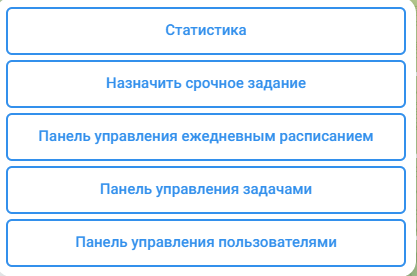
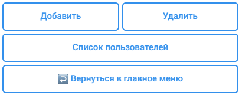
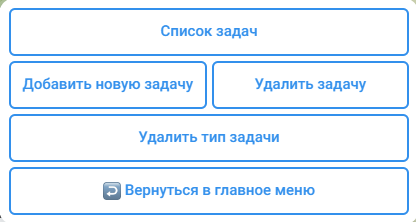
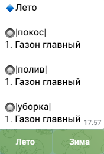
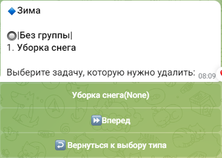
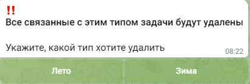
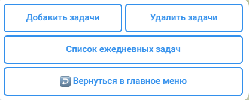
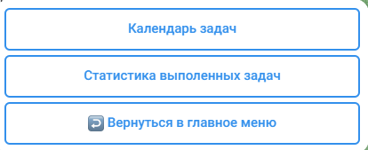

#  Руководство использование для администратора
## Главное меню

| Кнопка                                   | Назначение                                                                                                                                                                                |
|------------------------------------------|-------------------------------------------------------------------------------------------------------------------------------------------------------------------------------------------|
| Статистика                               | Представление информации в разрезе месяца в виде "ФИО->кол-во выполненных заданий"; Просмотр выполненных задач в разрезе дня "Задача->выполенно/не выполненн, кто выполнил, комментарий"; |
| Назначить срочное задание                | Добавить задание которое будет действовать в рамках одного дня                                                                                                                            |
| Панель управления ежедневным расписанием | Формирование списка ежедневных задач                                                                                                                                                      |
| Панель управление задачами               | Место хранение, редактирование всех задач                                                                                                                                                 |
| Панель управления пользователями         | Добавление новых пользователей, просмотр списка пользователей, удаление пользователей                                                                                                     |

# Панель управления пользователями

>Добавление нового пользователя

1. Переходим по следующему пути `Главное меню/Панель управления пользователями/Добавить`. На этом этапе вас попросит ввести
идентификатор пользователя которого хотите добавить. Идентификатор должен сообщить тот, кого вы добавляете. Он в свою
очередь может узнать его написав любое сообщение в чат боту. 

2. После этого укажите уровень доступа кнопкой с клавиатуры: `Администратор` или `Рабочий`.

3. Добавьте ФИО пользователя.

>Удаление пользователя

1. Переходим по следующему пути `Главное меню/Панель управления пользователями/Удалить`. Идентификатор нужного
пользователя можно узнать в `Главное меню/Панель управления пользователями/Список пользователей`

2. Подтверждаем выбор с клавиатуры ✅/❌

# Панель управления задачами

>Добавление новой задачи
1. Переходим по следующему пути `Главное меню/Панель управления задачами/Добавить новую задачу`.
2. Выбираем тип задачи через кнопки прикрепленные к сообщению. Под типом подразумевается разделение задач на большие 
группы, для более удобного восприятия, к примеру: 
`Летние задания`, `Зимние задания`, `Дополнительные задания` и т.п. Если вы хотите добавить новый тип, то
выберите кнопку `Придумать новый тип задачи`.
3. Придумайте название заданию
4. Укажите нужно ли ключевое слово для группировки. Это позволяет разделить большую задачу на подзадачи. 
К примеру: задачу `Газон главный` была поделена на подзадачи: `покос`, `полив`, `уборка`

>Удаление задачи
1. Переходим по следующему пути `Главное меню/Панель управления задачами/Удалить задачу`.
2. Выберите тип задачи через кнопки прикрепленные к сообщению.
3. Выберите задачу, которую хотитите удалить, через кнопки прикрепленные к сообщению. Для выбора нужной задачи,
используйте кнопки управления `⏩Вперед` и `⏪Назад`

>Удалить тип задач
1. Переходим по следующему пути `Главное меню/Панель управления задачами/Удалить тип задачи`.
2. Выберите тот тип, который необходимо удалить. `Все задачи этого типа будут удалены`

# Панель управления ежедневным расписанием

Панель управления ежедневным расписанием - это панель для составления списка ежедневных дел `(ЧЕК-ЛИСТ ЗАДАЧ)`

>Добавить новые задачи в ежедневное расписание
1. Переходим по следующему пути `Главное меню/Панель управления ежедневным расписанием/Добавить задачи`.
2. Выберите тип задачи, который хотите добавить.
3. Используя кнопки прикрепленные к сообщению, выберите интересующие задачи.

>Удалить задачи
1. Переходим по следующему пути `Главное меню/Панель управления ежедневным расписанием/Удалить задачи`.
2. Выберите тип задачи.
3. Используя кнопки прикрепленные к сообщению, выберите интересующие задачи.

# Статистика

> Просмотр выполненных задач по каждому дню
1. Переходим по следующему пути `Главное меню/Статистика/Календарь задач`
2. Используя кнопки прикрепленные к сообщению, выбираете интересующий день.

> Просмотр статистики по каждому рабочему 
1. Переходим по следующему пути `Главное меню/Статистика/Статистика выполненных задач`
2. Используя кнопки прикрепленные к сообщению, выбираете интересующий месяц.

# Назначить срочное задание

>Добавить задание действующее в рамках одного дня
1. Переходим по следующему пути `Главное меню/Добавить срочное задание`.
2. Напишите название задачи.

