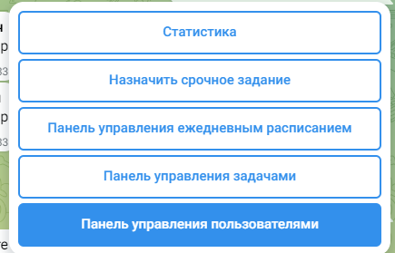

#  Руководство использование для администратора
## Главное меню

| Кнопка                                   | Назначение                                                                                                                                                                                |
|------------------------------------------|-------------------------------------------------------------------------------------------------------------------------------------------------------------------------------------------|
| Статистика                               | Представление информации в разрезе месяца в виде "ФИО->кол-во выполненных заданий"; Просмотр выполненных задач в разрезе дня "Задача->выполенно/не выполненн, кто выполнил, комментарий"; |
| Назначить срочное задание                | Добавить задание которое будет действовать в рамках одного дня                                                                                                                            |
| Панель управления ежедневным расписанием | Формирование списка ежедневных задач                                                                                                                                                      |
| Панель управление задачами               | Место хранение, редактирование всех задач                                                                                                                                                 |
| Панель управления пользователями         | Добавление новых пользователей, просмотр списка пользователей, удаление пользователей                                                                                                     |

# Панель управления пользователями

>Добавление нового пользователя

1. Переходим по следующему пути `Главное меню/Панель управления пользователями/Добавить`. На этом этапе вас попросит ввести
идентификатор пользователя которого хотите добавить. Идентификатор должен сообщить тот, кого вы добавляете. Он в свою
очередь может узнать его написав любое сообщение в чат боту. 

2. После этого укажите уровень доступа кнопкой с клавиатуры: `Администратор` или `Рабочий`.

3. Добавьте ФИО пользователя.

>Удаление пользователя

1. Переходим по следующему пути `Главное меню/Панель управления пользователями/Удалить`. Идентификатор нужного
пользователя можно узнать в `Главное меню/Панель управления пользователями/Список пользователей`

2. Подтверждаем выбор с клавиатуры ✅/❌

## Статистика

- Календарь задач

## Ведение списка задач
## Формирование списка ежедневных задач
## Добавление срочных задач