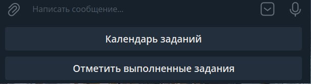
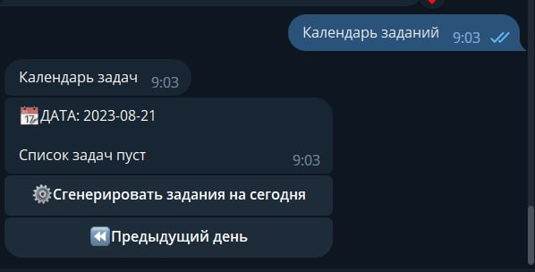
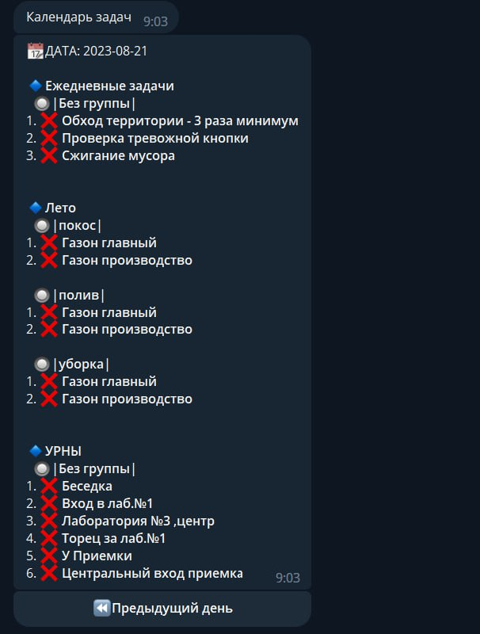
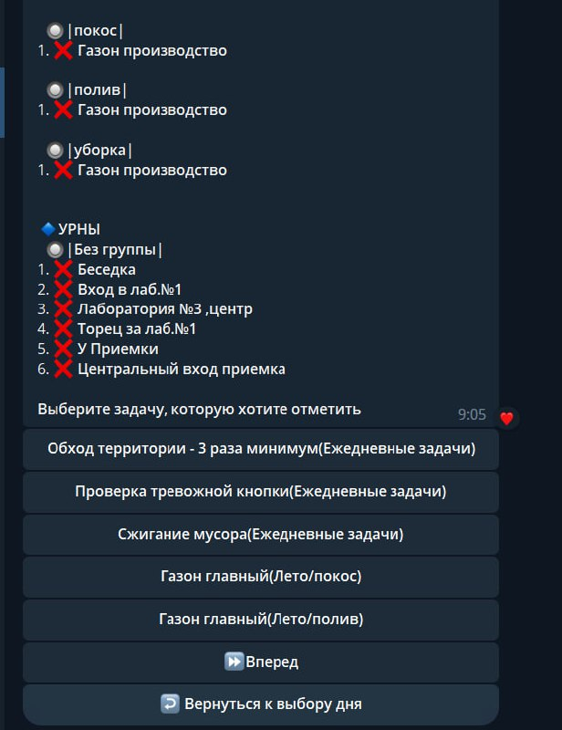

#  Руководство пользования для рабочего
## Главное меню

| Кнопка                       | Назначение                                                |
|------------------------------|-----------------------------------------------------------|
| Календарь заданий            | Просмотр выполенных/доступных заданий. Генерация заданий. |
| Отметить выполненные задания | Отметить задание выполненным, добавить комментарий        |

# Календарь заданий

>Генерация заданий

Используйте кнопку `⚙️Сгенерировать задания на сегодня` для того, чтобы получить список ежедневных дел на сегодня.

>Просмотр доступных заданий

# Отметить выполненные задания

1. Используя клавиши, выберите интересующую задачу `(Задачи идут перечислением по 5 штук)`. 
Используйте клавиатуру `⏩Вперед` и `⏪Назад`.
2. Подтвердите выполнение задачи ✅/❌
3. По желанию добавьте комментарий к выполненной задаче.